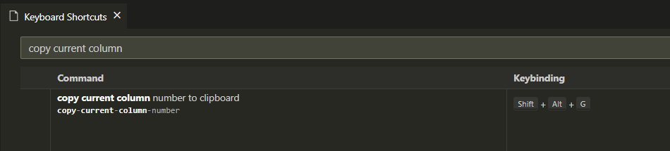

# copy-current-column-number README

Forked and altered from the [copy-current-line-number](https://marketplace.visualstudio.com/items?itemName=nzin4x.copy-current-line-number) extension by [nzin4x](https://github.com/nzin4x).

## Features

You can call the command through the Command Pallete (Ctrl+Shift+P), by typing "copy current column number to clipboard".

Or you can add a shortcut to it by accessing the keybindings list (Ctrl+Shift+P -> Keyboard Shortcuts), writing "copy current column" into the search bar and clicking into the Keybinding field.

